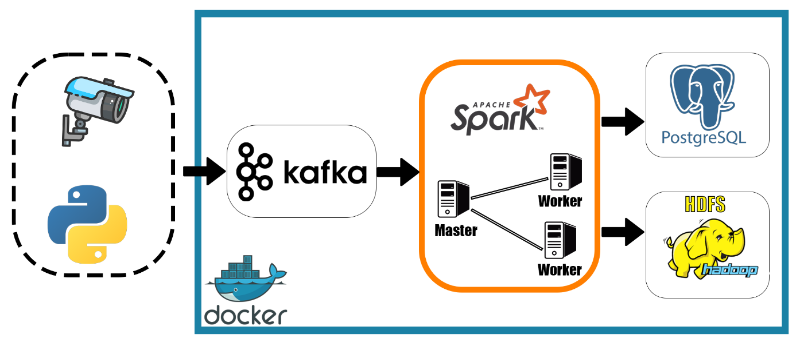

# Realtime streaming Vehicle Speed Pipeline

This project sets up a pipeline to process and analyze vehicle speed data in real-time using Apache Kafka, Apache Spark and PostgreSQL. The pipeline involves collecting data from Kafka, processing it with Spark Streaming, storing raw data in HDFS, and storing processed results in PostgreSQL.




### System Configuration

- **Apache Kafka:** For collecting and streaming data.
- **Apache Spark:** For real-time data processing.
- **HDFS:** For storing raw data.
- **PostgreSQL:** For storing processed speed data.

### Prerequisites

- Docker
- Docker Compose
- Python 3.x
- Apache Kafka
- Apache Spark
- PostgreSQL
- HDFS


### Installation

To run this project using Docker, follow command in terminal:

Install some lib for python
```
pip install -r requirements.txt
```

Docker-compose
```
docker-compose up -d
```

### Running the Pipeline
```
# Run traffic simulation - vehicle data
python ./jobs/data_simulator.py
```

```
# Step 1: Check running containers
docker ps

# Step 2: Access the Spark Master container
docker exec -it spark-master /bin/bash

# Step 3: Run Spark Submit inside the container
spark-submit \
--master spark://spark-master:7077 \
--deploy-mode client \
--name "Spark Streaming Job" \
--packages org.apache.spark:spark-sql-kafka-0-10_2.12:3.5.1,org.postgresql:postgresql:42.6.0 \
./jobs/spark_streaming_job.py

# Step 4: Monitor logs
# (Displays logs directly in the terminal)

# Step 5: Exit the container
exit
```

### Data Storage
- Raw Data: Stored in HDFS at hdfs://namenode:8020/raw_data/vehicle-data.
- Processed Data: Stored in PostgreSQL.

### Usage Instructions
* Kafka: Streams data from the configured topic.
* Spark Streaming: Processes data in real-time and writes raw data to HDFS and processed results to PostgreSQL.
* HDFS: Stores raw data for further analysis.
* PostgreSQL: Stores speed violation data.